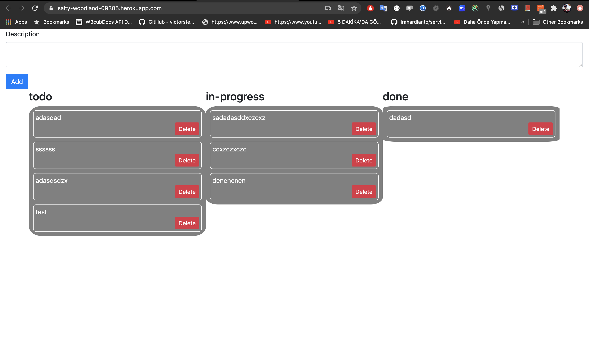

# Todos

Todo application is a frontend project developed with react.

# Demo-Preview



# Table of contents

Generally, If we take a look at the document, you can follow the table of contents below.

- [Todos](#todos)
- [Demo-Preview](#demo-preview)
- [Table of contents](#table-of-contents)
- [Installation](#installation)
- [Usage](#usage)
- [Deployment](#deployment)

# Installation
[(Back to top)](#table-of-contents)

To use this project, first clone the repo on your device using the command below:

```git init```

```git clone https://github.com/olucvolkan/todoApp-ui```


# Usage
[(Back to top)](#table-of-contents)

### `npm install`

before start run npm install command on cli for download dependencies.


```sh
$ cd todoApp-ui 
$ npm install
```

### `npm start`

```js
$ npm start
```

Runs the app in the development mode.<br />
Open [http://localhost:3000](http://localhost:3000) to view it in the browser.

The page will reload if you make edits.<br />
You will also see any lint errors in the console.

### `npm test`

```js
$ npm test
```

Launches the test runner in the interactive watch mode.<br />

### `npm build`

Builds the app for production to the `build` folder.<br />
It correctly bundles React in production mode and optimizes the build for the best performance.

The build is minified and the filenames include the hashes.<br />
Your app is ready to be deployed!

use below commands;

```js
$ npm install
$ npm start
$ json-server --watch db.json // api mock server you can use it if you want
```

and will open port as 3000


# Deployment

[(Back to top)](#table-of-contents)

Deployment has been done to [heroku](https://salty-woodland-09305.herokuapp.com/).

